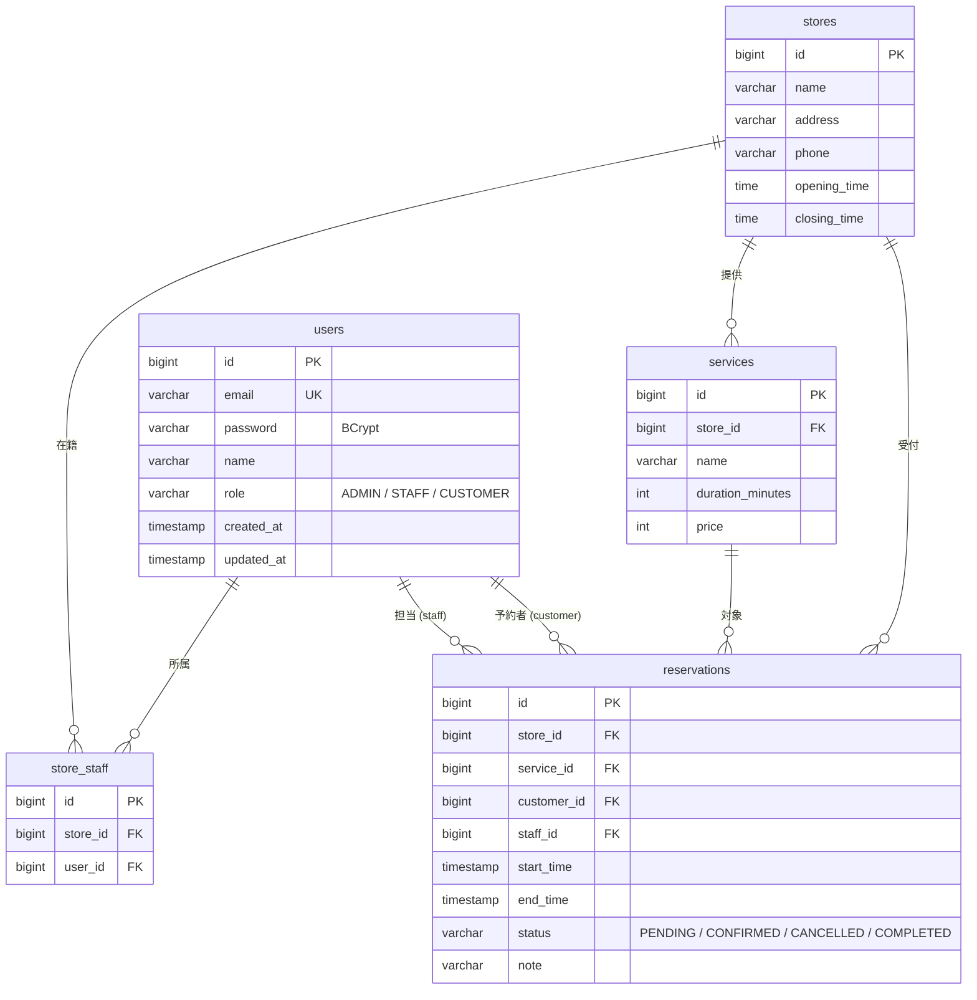

# ReserveCore

予約・売上・在庫管理を見据えた、**実務型の予約管理 REST API**（バックエンド）。
Spring Boot + PostgreSQL + Docker で構築し、**認証・認可・データ整合性・テスト**といった
バックエンド開発の基礎を一通り実装しています。


> **このリポジトリで伝えたいこと**
> 「動くものを作る」だけでなく、**二重予約をDBレベルで防ぐ**・**ロールごとに操作を制御する**・
> **マイグレーションでスキーマを管理する**・**実DBに対して結合テストを書く** といった、
> 実務で求められる観点を意識して設計しています。

---

## 目次
- [主なポイント](#主なポイント)
- [技術スタック](#技術スタック)
- [ER 図](#er-図)
- [API 一覧](#api-一覧)
- [権限モデル](#権限モデル)
- [セットアップと起動](#セットアップと起動)
- [動作確認（クイックスタート）](#動作確認クイックスタート)
- [テスト](#テスト)
- [設計上の工夫](#設計上の工夫)
- [ディレクトリ構成](#ディレクトリ構成)
- [今後の拡張（ロードマップ）](#今後の拡張ロードマップ)

---

## 主なポイント

| 観点 | 内容 |
|---|---|
| 🔐 認証 | JWT によるステートレス認証（パスワードは BCrypt でハッシュ化） |
| 🛡️ 認可 | URL レベル（SecurityFilterChain）＋ メソッドレベル（`@PreAuthorize`）＋ ドメイン権限（自店スタッフ判定）の**多層防御** |
| 🚫 二重予約防止 | **アプリ層の事前チェック（409）** と **DB の EXCLUDE 制約（最終防壁）** の二段構え |
| 🗄️ スキーマ管理 | Flyway でバージョン管理。`ddl-auto: validate` でエンティティとDBの乖離を検知 |
| ⚠️ 例外処理 | `@RestControllerAdvice` で**統一エラーフォーマット**＋適切な HTTP ステータス（400/401/403/404/409/500） |
| ✅ テスト | 実 PostgreSQL に対する**結合テスト 37 件**（権限・バリデーション・DB制約） |
| 🐳 再現性 | `docker compose up` だけで API + DB が起動 |

---

## 技術スタック

- **言語 / 実行環境**: Java 17
- **フレームワーク**: Spring Boot 3.2.5（Web / Data JPA / Security / Validation）
- **DB**: PostgreSQL 15（JPA / Hibernate, Flyway）
- **認証**: Spring Security + JWT（jjwt 0.11.5）
- **ビルド**: Gradle（Wrapper 同梱）
- **コンテナ**: Docker / Docker Compose（マルチステージビルド）
- **テスト**: JUnit 5 / Spring Boot Test / MockMvc

---

## ER 図



- **予約のリソース＝担当スタッフ（staff）**。同一スタッフの時間帯重複を DB の `EXCLUDE` 制約で禁止します。
- `services.duration_minutes`（所要時間）から予約の `end_time` を算出します。
- `store_staff` は店舗とスタッフの多対多。STAFF の「自店のみ操作可」を判定する基盤です。

---

## API 一覧

ベース URL: `http://localhost:8080`
認証が必要なエンドポイントは `Authorization: Bearer <JWT>` を付与します。

### 認証 `/api/auth`
| Method | Path | 認証 | 説明 |
|---|---|---|---|
| POST | `/api/auth/register` | 不要 | ユーザー登録（CUSTOMER として作成）＋ JWT 発行 |
| POST | `/api/auth/login` | 不要 | ログイン（JWT 発行） |

### ユーザー `/api/users`
| Method | Path | 認証 | 説明 |
|---|---|---|---|
| GET | `/api/users/me` | 全ロール | 自分の情報を取得 |
| GET | `/api/users` | **ADMIN** | 全ユーザー一覧 |

### 店舗 `/api/stores`
| Method | Path | 認証 | 説明 |
|---|---|---|---|
| POST | `/api/stores` | **ADMIN** | 店舗登録（営業時間 開店 < 閉店 を検証） |
| GET | `/api/stores` | 全ロール | 店舗一覧 |
| GET | `/api/stores/{id}` | 全ロール | 店舗詳細（存在しなければ 404） |

### サービス（メニュー）`/api/stores/{storeId}/services`
| Method | Path | 認証 | 説明 |
|---|---|---|---|
| POST | `/api/stores/{storeId}/services` | **ADMIN / 自店STAFF** | サービス登録 |
| GET | `/api/stores/{storeId}/services` | 全ロール | サービス一覧 |

### 予約 `/api/reservations`
| Method | Path | 認証 | 説明 |
|---|---|---|---|
| POST | `/api/reservations` | 全ロール（本人名義） | 予約登録。所要時間から終了時刻を算出し、営業時間・重複を検証 |
| GET | `/api/reservations` | 全ロール | 一覧（CUSTOMER=自分のみ / ADMIN・STAFF=全件） |
| PATCH | `/api/reservations/{id}/cancel` | 本人 / ADMIN・STAFF | 予約をキャンセル（`CANCELLED` へ） |

### エラーレスポンス（統一フォーマット）
```json
{
  "status": 409,
  "message": "指定の時間帯はすでに予約が入っています",
  "fieldErrors": null,
  "timestamp": "2026-06-04T10:00:00"
}
```
| ステータス | 主なケース |
|---|---|
| 400 | バリデーション違反 / 業務ルール違反（営業時間外・不正な引数） |
| 401 | 未認証（トークンなし・不正） |
| 403 | 権限不足（ロール不適合） |
| 404 | リソースが存在しない |
| 409 | 競合（同一スタッフの二重予約） |

---

## 権限モデル

| ロール | できること |
|---|---|
| **ADMIN** | 全操作（店舗・サービス登録、全ユーザー閲覧、全予約の閲覧・キャンセル） |
| **STAFF** | 自店のサービス登録、全予約の閲覧・キャンセル |
| **CUSTOMER** | 予約の登録（本人名義）、自分の予約の閲覧・キャンセル |

> 認可は **3 層**で実装しています。
> 1. **URL レベル**：`/api/auth/**` は公開、それ以外は認証必須（`SecurityConfig`）
> 2. **メソッドレベル**：`@PreAuthorize("hasRole('ADMIN')")`（例：店舗登録・ユーザー一覧）
> 3. **ドメイン権限**：「自店スタッフか」「予約の本人か」をサービス層で判定し `403` を返却

---

## セットアップと起動

### 必要なもの
- **Docker / Docker Compose**（これだけで API + DB が起動します）
- ローカルでビルド・テストする場合のみ **JDK 17**（Gradle Wrapper 同梱のため Gradle 本体は不要）

### A. Docker だけで起動（推奨）
```bash
git clone <this-repo>
cd ReserveCore
docker compose up --build
```
- `db`（PostgreSQL 15）と `app`（Spring Boot）が起動します。
- 起動時に **Flyway** が `V1〜V3` のマイグレーションを適用します。
- 初期 **ADMIN** が自動投入されます（下記）。
- API: `http://localhost:8080`

### B. DB は Docker、アプリはローカル実行
```bash
docker compose up -d db          # DB だけ起動
./gradlew bootRun                # アプリをローカル起動（要 JDK 17）
```

### 初期 ADMIN アカウント（開発用）
| email | password |
|---|---|
| `admin@reservecore.com` | `admin1234` |

> ⚠️ これは**開発用のデフォルト値**です。`application.yml` の `app.admin.*` および `app.jwt.secret` は
> 環境変数（`ADMIN_EMAIL` / `ADMIN_PASSWORD` / `JWT_SECRET` など）で上書きでき、**本番では必ず変更**してください。

---

## 動作確認（クイックスタート）

```bash
# 1) ADMIN でログインして JWT を取得
TOKEN=$(curl -s -X POST http://localhost:8080/api/auth/login \
  -H "Content-Type: application/json" \
  -d '{"email":"admin@reservecore.com","password":"admin1234"}' \
  | sed -E 's/.*"token":"([^"]+)".*/\1/')

# 2) 店舗を登録（ADMIN 限定）
curl -s -X POST http://localhost:8080/api/stores \
  -H "Authorization: Bearer $TOKEN" -H "Content-Type: application/json" \
  -d '{"name":"渋谷店","address":"東京都渋谷区1-1-1","openingTime":"09:00","closingTime":"18:00"}'

# 3) サービス（メニュー）を登録
curl -s -X POST http://localhost:8080/api/stores/1/services \
  -H "Authorization: Bearer $TOKEN" -H "Content-Type: application/json" \
  -d '{"name":"カット","durationMinutes":60,"price":4000}'

# 4) 一般ユーザーを登録（CUSTOMER）
curl -s -X POST http://localhost:8080/api/auth/register \
  -H "Content-Type: application/json" \
  -d '{"email":"taro@example.com","password":"password123","name":"山田太郎"}'
```

> **予約の作成について**：予約には「店舗に所属する担当スタッフ（`staff_id`）」が必要です。
> 現状の MVP には *STAFF ユーザー作成* と *スタッフの店舗割り当て（`store_staff`）* の管理 API がまだ無いため
> （[ロードマップ](#今後の拡張ロードマップ)参照）、`cURL` だけで予約フローを端から端まで再現するには
> `store_staff` への割り当てが必要です。**予約の全フロー（登録 → 二重予約 409 → キャンセル）は
> 結合テストで検証済み**です（`ReservationControllerTest`）。

---

## テスト

実 PostgreSQL に対して **結合テスト 37 件**を実行します（DB コンテナの起動が前提）。

```bash
docker compose up -d db
./gradlew test --no-daemon
```

| テストクラス | 件数 | 主な検証内容 |
|---|---:|---|
| `AuthControllerTest` | 5 | 登録 / ログイン / 重複・バリデーション |
| `UserControllerTest` | 4 | JWT 認証とロール別アクセス（401 / 403） |
| `StoreControllerTest` | 7 | 店舗登録の権限・営業時間バリデーション・404 |
| `ServiceControllerTest` | 8 | 「ADMIN / 自店STAFF は可、他店STAFF・CUSTOMER は 403」 |
| `ReservationControllerTest` | 10 | 予約登録 / 二重予約 409 / 営業時間外 400 / 一覧の見え方 / キャンセル権限 |
| `ReservationConstraintTest` | 3 | DB の `EXCLUDE` 制約が効くこと（重複拒否・連続予約許可・キャンセルは枠を塞がない） |

> 全結合テストは共通基盤 `IntegrationTestSupport` を継承し、各テスト前に
> **外部キー整合を保つ順序で全テーブルを初期化**します（テスト実行順に依存しない設計）。

---

## 設計上の工夫

### 1. 二重予約防止の「二段構え」
同一スタッフの時間帯が重なる予約を、**2 つのレイヤー**で防ぎます。

1. **アプリ層の事前チェック**：登録前に重複予約を検索し、あれば分かりやすい `409` を返す
2. **DB の `EXCLUDE` 制約（最終防壁）**：同時実行で事前チェックをすり抜けても、DB が拒否

```sql
-- V3__add_exclude_constraint.sql
CREATE EXTENSION IF NOT EXISTS btree_gist;
ALTER TABLE reservations
  ADD CONSTRAINT no_overlap_per_staff
  EXCLUDE USING gist (
      staff_id WITH =,
      tsrange(start_time, end_time, '[)') WITH &&   -- 半開区間：11:00終了と11:00開始は重複しない
  )
  WHERE (status IN ('PENDING', 'CONFIRMED'));        -- 枠を実際に塞ぐ状態だけ対象
```
DB 制約違反（`DataIntegrityViolationException`）はサービス層で捕捉し、API としては `409 Conflict` に変換します。
**アプリ側のチェックだけに頼らず、整合性の最後の砦を DB に置く**という考え方を実装で示しています。

### 2. 多層の認可
URL（フィルタ）・メソッド（`@PreAuthorize`）・ドメイン（自店判定・本人判定）の 3 層で権限を制御します。
「画面で制御するから大丈夫」ではなく、**バックエンド単体で安全**な状態を目指しています。

### 3. Flyway によるスキーマ管理
`ddl-auto: validate` とし、テーブル定義は Flyway（`V1〜V3`）が単一の正とします。
エンティティと DB スキーマが乖離した場合は**起動時に検知**できます。

### 4. 統一されたエラーハンドリング
`@RestControllerAdvice` で例外を一元処理し、`{status, message, fieldErrors, timestamp}` の統一フォーマットで返却。
バリデーションエラーはフィールド単位のメッセージを返します。

### 5. レイヤードアーキテクチャ
`api`（入出力）/ `domain`（業務ロジック・永続化）/ `security` / `common` に責務を分離。
DTO は Java `record`、エンティティとレスポンスを分離し、パスワード等の機密情報は API に露出しません。

---

## ディレクトリ構成

```
src/main/java/com/reservecore/
├── api/                      # コントローラ + リクエスト/レスポンス DTO(record)
│   ├── auth/                 #   登録・ログイン
│   ├── user/                 #   ユーザー情報
│   ├── store/                #   店舗
│   ├── service/              #   サービス（メニュー）
│   └── reservation/          #   予約
├── domain/                   # ドメイン（エンティティ + リポジトリ + サービス）
│   ├── user/  store/  service/  reservation/
├── security/                 # JWT ユーティリティ / フィルタ / Security 設定
├── config/                   # 初期 ADMIN 投入（CommandLineRunner）
└── common/exception/         # 例外クラス + 統一エラーレスポンス

src/main/resources/
├── application.yml
└── db/migration/             # Flyway: V1(users) / V2(予約ドメイン) / V3(EXCLUDE制約)

src/test/java/com/reservecore/
├── support/                  # IntegrationTestSupport（結合テスト共通基盤）
└── api/ ... domain/ ...      # 結合テスト 37 件
```

---

## 今後の拡張（ロードマップ）

MVP（認証・権限・予約 CRUD）完成後に想定している拡張です。

- [ ] **スタッフ管理 API**：STAFF ユーザーの作成、`store_staff` への割り当て（予約フローを API だけで完結させる）
- [ ] **CI**：GitHub Actions で push / PR 時にビルド＆テストを自動実行
- [ ] **予約の承認フロー**：`PENDING → CONFIRMED`（現状は登録時に `CONFIRMED`）
- [ ] **リソースの一般化**：座席・席・設備など「スタッフ以外の予約枠」への対応
- [ ] **売上・在庫**：会計・在庫引当（予約に金額スナップショットを保持）
- [ ] **営業時間の高度化**：定休日・日跨ぎ営業・祝日対応
- [ ] **運用面**：`TIMESTAMPTZ` 化（タイムゾーン）、リフレッシュトークン、API ドキュメント（OpenAPI/Swagger）

---

> 本リポジトリはバックエンド学習・選考提出を目的としたポートフォリオです。
> 設計の意図や「なぜそうしたか」を重視して実装しています。
